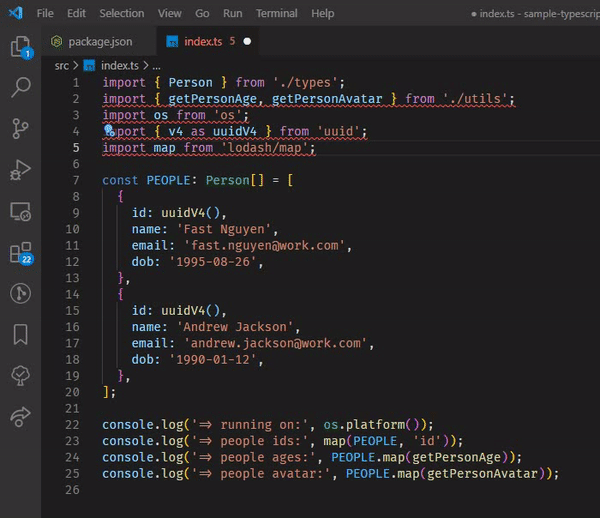

# How to sort imports like a pro in TypeScript

Crossing reviews becomes a very common activity today in the engineering behavior. To help us reviews changes for pull/merge requests easier, **sorting imports** can help us a much. 
The codebase becomes more professional, more consistency, reviewers will be happier, and the review process will be faster, focus on the implementation changes **ONLY**.

Have you ever thought about how to sort imports in TypeScript projects automatically?

Let me show you how to archive sorting imports **automatically** in **TypeScript** projects with **ESLint**!

<br>



<br>

## Table of contents

- [How to sort imports like a pro in TypeScript](#how-to-sort-imports-like-a-pro-in-typescript)
  - [Table of contents](#table-of-contents)
  - [Prerequisites](#prerequisites)
  - [First steps with ESLint](#first-steps-with-eslint)
  - [Configure ESLint to sort imports](#configure-eslint-to-sort-imports)
  - [Configure VSCode to sort imports automatically](#configure-vscode-to-sort-imports-automatically)
  - [Conclusion](#conclusion)
  - [References](#references)


## Prerequisites

- Have **TypeScript** projects
- Have some basic knowledge about ESLint - a JavaScript linting tool
- Have time to go through all steps in this article 😀

## First steps with ESLint

- Install `devDependencies` packages related to `eslint` in TypeScript project

```sh
yarn add -D eslint @typescript-eslint/parser @typescript-eslint/eslint-plugin prettier eslint-config-prettier eslint-plugin-prettier
```

- Create `eslint` base configuration for TypeScript project

**.eslintrc.js** file

```javascript
module.exports = {
  parser: '@typescript-eslint/parser',
  parserOptions: {
    ecmaVersion: 2018,
    sourceType: 'module',
  },
  env: {
    node: true,
  },
  plugins: ['@typescript-eslint', 'prettier'],
  extends: [
    'eslint:recommended',
    'plugin:@typescript-eslint/recommended',
    'plugin:prettier/recommended',
  ]
};
```

## Configure ESLint to sort imports

  1. Configure ESLint base `sort-imports` rules

  With this native ESLint rule [sort-imports](https://eslint.org/docs/rules/sort-imports), I use it to sort member imports in the import statements. You can notice that it supports more features for sorting imports.
  But I will use another plugin for advanced import sorting

  Outcome: 
  `import { c, b, a } from 'package-to-import'` 
  
  => `import { a, b, c } from 'package-to-import'`


  - Update `.eslintrc.js` file by adding `rules`

  **.eslintrc.js** file

  ```javascript
  module.exports = {
    // Extends the previous ESLint configuration by adding rules
    // <--! Previous configuration comes here !-->
    rules: {
      'sort-imports': [
        'error',
        {
          ignoreCase: false,
          ignoreDeclarationSort: true, // don"t want to sort import lines, use eslint-plugin-import instead
          ignoreMemberSort: false,
          memberSyntaxSortOrder: ['none', 'all', 'multiple', 'single'],
          allowSeparatedGroups: true,
        },
      ]
    }
  };
  ```

  2. Configure `import` rule with `eslint-plugin-import` package

 - Install `eslint-plugin-import` package to use plugin import in ESLint

   ```sh
   yarn add -D eslint-plugin-import
   ```

 - Configure `import` rules

   In this step, we configure the order of our imports. There are two important information. There are `groups` indicates how we get import statement sorted, and `alphabetize` indicates how we sort import lines by alphabet

   Now, let's update the current ESLint configuration by adding new `import` rules

   **.eslintrc.js** file

   ```javascript
   module.exports = {
     // <--! Previous configuration comes here !-->

     plugins: ['@typescript-eslint', 'prettier', 'import'], // Add "import" plugin
     extends: [
       'eslint:recommended',
       'plugin:@typescript-eslint/recommended',
       'plugin:prettier/recommended',

       // Extends two more configuration from "import" plugin
       'plugin:import/recommended',
       'plugin:import/typescript',
     ],
     rules: {
       // <--! Previous rules come here !-->

       // turn on errors for missing imports
       'import/no-unresolved': 'error',
       // 'import/no-named-as-default-member': 'off',
       'import/order': [
         'error',
         {
           groups: [
             'builtin', // Built-in imports (come from NodeJS native) go first
             'external', // <- External imports
             'internal', // <- Absolute imports
             ['sibling', 'parent'], // <- Relative imports, the sibling and parent types they can be mingled together
             'index', // <- index imports
             'unknown', // <- unknown
           ],
           'newlines-between': 'always',
           alphabetize: {
             /* sort in ascending order. Options: ["ignore", "asc", "desc"] */
             order: 'asc',
             /* ignore case. Options: [true, false] */
             caseInsensitive: true,
           },
         },
       ],
     }
   };
   ```

  3. Configure `import resolver` with `eslint-import-resolver-typescript` package

  Why do we need this package? It helps us resolve package, imports, module under the TypeScript project. Some of us may use `compilerOptions.baseUrl` or `compilerOptions.paths` in the `tsconfig.json` configuration file.

  - Install `eslint-import-resolver-typescript` package

    ```sh
    yarn add -D eslint-import-resolver-typescript
    ```

  - Configure `eslint-import-resolver-typescript` package

    Extends the current ESLint configuration by adding new section called `settings`

    **.eslintrc.js** file

    ```javascript
    module.exports = {
      // Extends the previous ESLint configuration by adding `settings`
      // <--! Previous configuration comes here !-->
      settings: {
        'import/resolver': {
          typescript: {
            project: './tsconfig.json',
          },
        },
      },
    };
    ```

## Configure VSCode to sort imports automatically

To help us trigger ESLint auto fix feature, to resolve a lot of fixable ESLint issues come from your current working file.

Create new VSCode `settings.json` file under `./vscode/settings.json`

```json
{
  "editor.formatOnSave": false,
  "eslint.validate": [
    "typescript"
  ],
  "editor.codeActionsOnSave": {
    "source.fixAll": true
  }
}
```

**BONUS** section:

In case, you do not work on Visual Studio Code IDE,
You can add new script command to run sort imports manually

**package.json** file
```json
{
  // <--! Current content of the package.json file goes there !-->
  "scripts": {
    "lint": "eslint --ext .ts ./src",
    "lint:fix": "npm run lint -- --fix"
  }
}
```

Now you just run ONLY one single command `yarn lint:fix` to fix all coding style issues catch by ESLint. Easy work, right? 😁

## Conclusion

To sum of all of the steps we need to get our TypeScript project imports sorted automatically, there are 3 steps:

- Configure ESLint base for our TypeScript project
- Configure ESLint to sort imports
- Configure VSCode to sort imports automatically

And that is all from me for this time, thank you for reading my sharing article. Hope you can find it helpful!

Any concerns, or questions, do not hesitate to put it in the response section below.
See you next time!

## References

- [ESLint `sort-imports`](https://eslint.org/docs/rules/sort-imports)
- [ESLint `import` plugin](https://github.com/import-js/eslint-plugin-import)
- [ESLint `import` TypeScript resolver plugin](https://github.com/alexgorbatchev/eslint-import-resolver-typescript)
- [My sample TypeScript project](https://github.com/phatnguyenuit/sample-typescript)